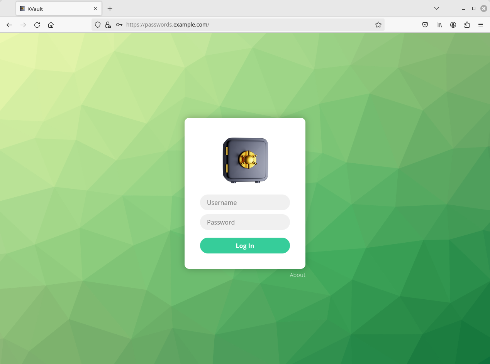
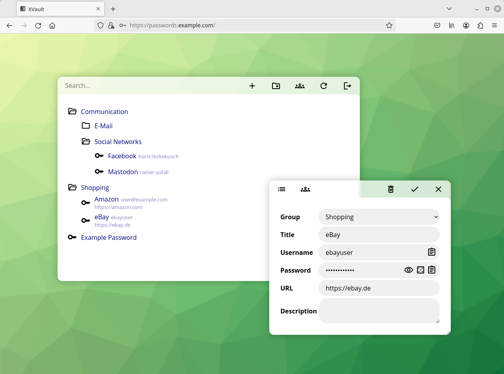
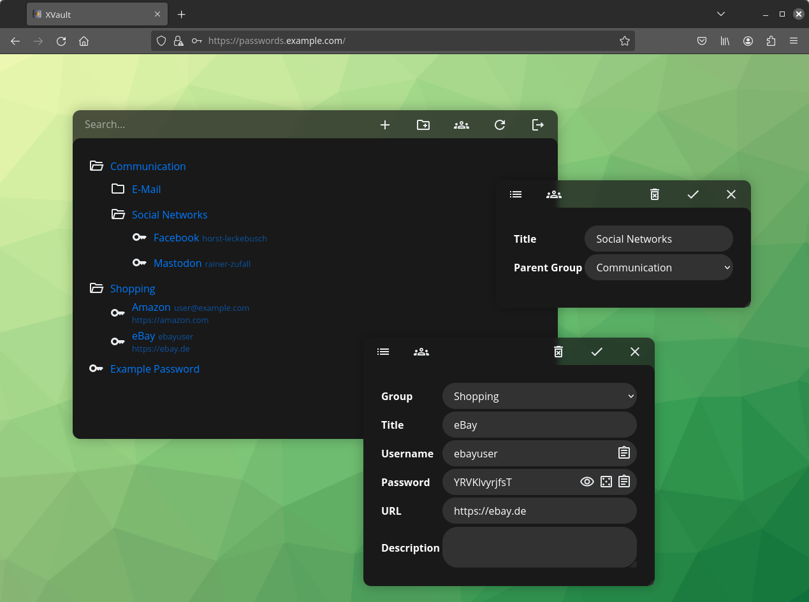

# XVault
XVault is a self-hosted/on-prem web based password safe with multi-language and multi-user support focused on enterprise usage. Password entries are stored AES encrypted in a MySQL database, and the AES key is RSA encrypted for every permitted user. Decryption only happens in the user's browser, providing true end-to-end encryption.

## Concept and Advantages
In contrast to conventional password safes, keys to the stored secrets are not encrypted with one static password, but with an individual per-user generated public/private key pair. This is done having enterprise usage in mind: employees should only have access to passwords they need as defined by group memberships, and not to the entire password safe. With this, there is no need to share a common master password which needs to be changed after one employee leaves the company.

LDAP authentication allows seamless integration into your companies environment. Access to the passwords can immediately be denied by disabling the LDAP user account. Beside using XVault as private/personal password store, a flexible share function allows you to share passwords or entire password groups with specific co-workers or groups of users.

There is no database file which needs to be shared with all employees. Nobody except the administrator has access to the *encrypted* passwords. Attackers can't copy the user keys or encrypted passwords to run efficient brute force attacks against them.

Since de-/encryption only happens on the client side, passwords are still save since even if the communication between server and client is intercepted.

The web app is independent of the client platform and it is not necessary to install or deploy any client software.

## Screenshots




## Setup
### Server Requirements
Linux based server (Debian recommended) with Apache 2, PHP 7.4+ and MySQL/MariaDB. An LDAP server is recommended since this app is mainly intended for usage with LDAP authentication.

### Server Installation
0. Install necessary Linux packages: `apt install apache2 libapache2-mod-php php php-ldap composer`
1. Configure Apache:
   - Set the application's `public` directory as the webserver root directory (if necessary, create a virtual host for this application on your webserver).
   - Ensure that `AllowOverride All` is set for your application directory in your Apache configuration.
   - Set up HTTPS for your Apache. This is necessary since web browsers expose the crypto API only in secure contexts. Redirect all HTTP requests to HTTPS. Use at least a RSA 4096 bit key pair (certificate) or elliptic curve crypto.
2. Run `composer install` inside the application root directory to install the dependencies.
3. Create an empty database on your MySQL server and import the schema from the `sql/SCHEMA.sql` file.
   ```
   root@server:/# mysql
   mysql> CREATE DATABASE pwsafe DEFAULT CHARACTER SET utf8mb4;
   mysql> CREATE USER 'pwsafe'@'localhost' IDENTIFIED BY 'choose_your_own_password';
   mysql> GRANT ALL PRIVILEGES ON pwsafe.* TO 'pwsafe'@'localhost';
   mysql> FLUSH PRIVILEGES;
   mysql> EXIT;
   root@server:/# mysql -D pwsafe < sql/SCHEMA.sql
   ```
4. Create `config/settings.php` from `config/settings.php.example` and enter your MySQL connection credentials, LDAP connection parameters and adjust other settings if you like. Read the comments in the [example file](config/settings.php.example) for more information.
5. Create users:
   - LDAP sync: execute `php bin/ldapsync.php` and set up a cron job as described in the example config file.
   - Local user accounts: `php bin/user.php create USERNAME DISPLAY_NAME PASSWORD`.
     Note that local accounts are only intended for testing or emergency purposes (you can add the local account to a user group of your top-level password folder so that every password gets encrypted to the local user too - this allows you to access passwords even if your LDAP server isn't working anymore).
6. Thats it. Open a webbrowser, navigate to your installation and log in with an LDAP or local account.

### Backup
Don't forget to backup your database regularly, e.g. by executing `mysqldump pwsafe > backup.sql` via crontab. Save the file on another, secure storage!

### Hardening Recommendations
- Transfer the ownership of the application files to root and deny write access for all other users. The web server user (www-data) should only be able to read the application files.
- Use strong passwords for your Linux system users and MySQL accounts.
- Do not run other applications on the same server.
- Ensure that the MySQL server only listens for requests from localhost and not from other computers inside your network. Do not use tools like phpMyAdmin on your production server.
- Install `fail2ban` to limit brute force attacks.
- Keep your server always up to date by installing/enabling `unattended-upgrades`.
- Limit access to the IP addresses/ranges that really need it, e.g. via Apache or firewall rules.

### Client Requirements
Crypto API capable browser with Javascript enabled
- Chrome/Chromium based browsers, Firefox (both desktop and mobile)
- IE/Edge are **not** supported

### Upgrade notes for v0.x (WebPW) users
Since the concept and database schema of XVault differs completely from v0.x ("WebPW"), there is no direct upgrade path. You need to manually export and re-import your passwords in the new version.

## FAQ
### I'm not able to share passwords with some users, they are disabled in the select box
The user account doesn't have a keypair yet. Users need to log in once before passwords can be shared with them.

## Roadmap
- shares with r/o permission
- file storage support
- custom entry icons

## Support
You need support or specific adjustments for your environment? You can hire me to extend this project to your needs. Please [contact me](https://georg-sieber.de/?page=impressum) if you are interested.

Found a bug? Great! Please report it (preferably with a ready-to-use fix as pull request) on GitHub. Questions, ideas, feature requests or just (hopeful positive) feedback is also welcome.
